# TI83+ programs and games

> A chapter of featherless' [digital creative history](https://github.com/featherless/digital-creative-history).

For my 13th Christmas (2001) I received a TI83+ graphing calculator. No longer battling for the
computer as a shared house resource, I was now free to learn how to program literally anywhere.

I built the example applications at the back of the TI83+ manual — volume of a cylinder and
sierpinski's triangle — and soon after began deconstructing the TIBasic games found on school
calculators.

Being able to transfer programs between calculators easily became a critical part of my learning
TIBasic. I could build a game or program and share it with friends and they'd share it with their
friends and so on.

# ticalc.org

- [My profile on ticalc.org](http://www.ticalc.org/cgi-bin/acct-view.cgi?userid=24790)
- [My games on ticalc.org](http://www.ticalc.org/archives/files/authors/60/6073.html)

My profile:

> I am a basic programmer for ti83+, I also program in HTML, CSS, JavaScript, learning C++, and
> Java. Currently I am 14 years old and a freshman in high school. 
>
> working on new site for all of my programs.... 
>
> www21.brinkster.com/jverkoey/tiproject/

# Games

## Tileflip

- When: November 2001

TileFlip is a remake of the game BeJeweled.

[View the source](tileflip/).

## Epic

- When: January 2002

An interactive story.

[View the source](epic/).

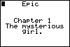
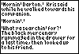

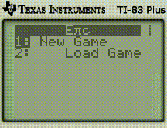

## Raging Flame

A full-fledged RPG for the TI83+. This game went through many iterations, but it always kept the
same basic principle of random encounters, exploration of a world map, leveling up, and fighting an
evil wizard.

[View the source](Raging Flame/).

Development of the TI83+ version of the game ended in early 2003 due to my computer's hard drive
being wiped out:

> One note on the bad-side, about 6 or 7 months ago, my computer's harddrive was wiped, therefor
> clearing every single one of the calculator programs that I've ever created, so I lost most of the
> new Raging Flame engine and such, but most of the stuff is recreatable, I just haven't really had
> the will to do so recently, and I'm also developing video games for the computer now, so I guess
> I've moved on, heh.

### Raging Flame 2: Legend of Krynn

- When: February 2002

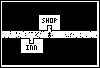
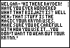
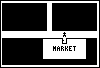

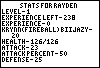
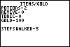
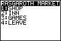
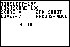
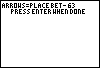
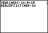

## Rapid-fire RPG (RFRPG)

A "promotional demo" of a rapid-fire RPG concept.

[View the source](rfrpg/).

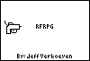
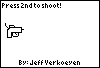

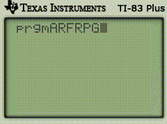

# License

All source code is licensed Apache 2.0.

> A chapter of featherless' [digital creative history](https://github.com/featherless/digital-creative-history).
