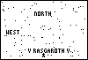
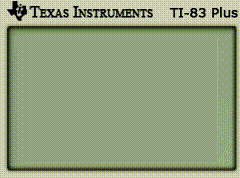
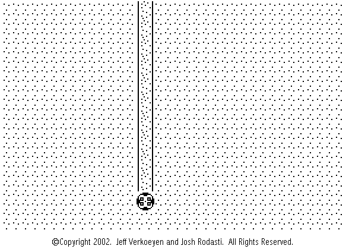
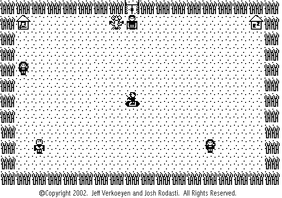
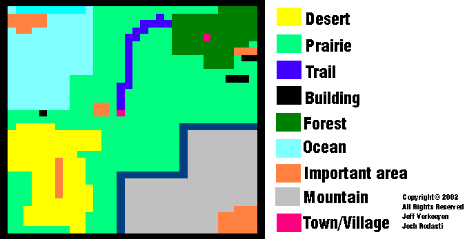

# TI83+ programs and games

> A chapter of featherless' [digital creative history](https://github.com/featherless/digital-creative-history).

For my 13th Christmas (2001) I received a TI83+ graphing calculator. No longer battling for the
computer as a shared house resource, I was now free to learn how to program literally anywhere.

I built the example applications at the back of the TI83+ manual — volume of a cylinder and
sierpinski's triangle — and soon after began deconstructing the TIBasic games found on school
calculators.

Being able to transfer programs between calculators easily became a critical part of my learning
TIBasic. I could build a game or program and share it with friends and they'd share it with their
friends and so on.

# ticalc.org

- [My profile on ticalc.org](http://www.ticalc.org/cgi-bin/acct-view.cgi?userid=24790)
- [My games on ticalc.org](http://www.ticalc.org/archives/files/authors/60/6073.html)

My profile:

> I am a basic programmer for ti83+, I also program in HTML, CSS, JavaScript, learning C++, and
> Java. Currently I am 14 years old and a freshman in high school. 
>
> working on new site for all of my programs.... 
>
> www21.brinkster.com/jverkoey/tiproject/

# Games

## Keldfolc

- When: May 2001

## Guess the Number

- When: October 2001

## Poker

- When: December 2001

## HitShot

- When: February 2002

## Roidian

- When: March 2002

## Epic

- When: January 2002

An interactive story.

[View the source](epic/).

## Raging Flame

A full-fledged RPG for the TI83+. This game went through many iterations, but it always kept the
same basic principle of random encounters, exploration of a world map, leveling up, and fighting an
evil wizard.

[View the source](Raging Flame/).

Development of the TI83+ version of the game ended in early 2003 due to my computer's hard drive
being wiped out:

> One note on the bad-side, about 6 or 7 months ago, my computer's harddrive was wiped, therefor
> clearing every single one of the calculator programs that I've ever created, so I lost most of the
> new Raging Flame engine and such, but most of the stuff is recreatable, I just haven't really had
> the will to do so recently, and I'm also developing video games for the computer now, so I guess
> I've moved on, heh.

### Raging Flame 2: Legend of Krynn

- When: February 2002

### Raging Flame 3

Originally posted to the [TI 83+ Project Development Area site](https://github.com/featherless/ti83plus-site)

> To all you fans of Raging Flame, I am truly sorry, but I am no longer going to work on Raging
> Flame for the calculator. I have "moved on" I guess you could say, from the calculator to making
> RPG's on the computer instead. I am giving anyone who wants to, permission to edit/change this
> game if they want, but always link back to me, or I'll hunt you down.
>
> Hey everyone, welcome to the link off of the PDS (Project Development Site) which is completely
> dedicated to the Raging Flame Trilogy. I will be posting back here with more news and updates as
> to what is going on.
>
> **Updates for: Monday, May 20, 2002**
>
> First part of Raging Flame's world map, I'll be updating piece-by-piece-
>
> 
>
> **Updates for: Tuesday, April 23, 2002**
>
> Here is the first town in the game- Tulin, which is so far completely finished, I just need to
> program in the shop, and then i'll start working on the other 1033 screens (it'll be quite easy
> using the sub-routines i've invented, which run extremely fast and effectively) This map is
> actually 3x3 screens, but I compiled them all into one big picture.
>
> 
>
> **Updates for: Sunday, April 21, 2002**
>
> Here is the world map for Raging Flame 1-
>
> 

## Rapid-fire RPG (RFRPG)

A "promotional demo" of a rapid-fire RPG concept.

[View the source](rfrpg/).

## Arcade

- When: March 2002

## Memory

- When: November 2002

## Tileflip

- When: November 2002

TileFlip is a remake of the game BeJeweled.

[View the source](tileflip/).

# License

All source code is licensed Apache 2.0.

> A chapter of featherless' [digital creative history](https://github.com/featherless/digital-creative-history).
